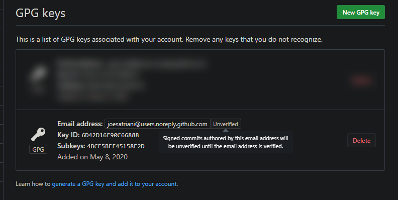
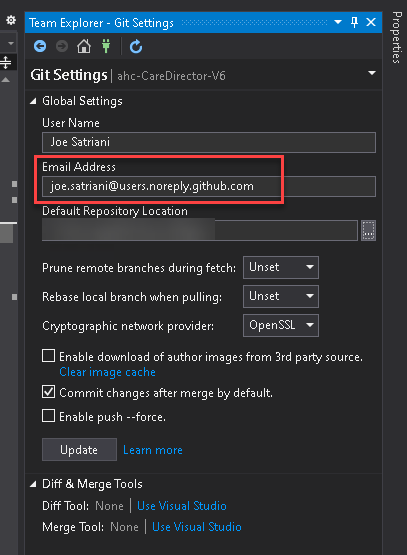

# Configure Github to sign commits with GPG signature

The following document describes how to use a GPG signing key to sign individual commits and make them verifiable in Github. It's not the scope of this document to describe how public/private key pairs work, there are plenty of resources for that everywhere, but suffice it to say we'll be signing commits with a private key (which cannot be shared with anyone).
Then, we'll give away our public key so those privately signed elements can be verified by others, and they'll know we were the ones who signed them. 👍

# Table of Contents
* [Install GPG software](#install-gpg-software)
* [Generate the signing key](#generate-the-signing-key)
    * [Choosing the signing email address](#choosing-the-signing-email-address)
    * [Verified email address](#verified-email-address)
* [Export the public key](#export-the-public-key)
* [Import the key into Github](#import-the-key-into-github)
* [Using your key in other computer](#using-your-key-in-other-computer)
* [Configure GIT in the signing computer](#configure-git-in-the-signing-computer)
* [Configure GIT clients](#configure-git-clients)
* [Signing commits](#signing-commits)
* [Signing tags](#signing-tags)

## Install GPG software

I will be using this one for Windows:

[GPG 4 Win](https://www.gpg4win.org/)

Or for additional platforms you can try any of these, the process is similar:

[GnuPG Downloads](https://www.gnupg.org/download/)

## Generate the signing key

Verify if you have any GPG key installed:
```
gpg --list-secret-keys --keyid-format LONG
```
If you have no keys generated continue to generate a new one, otherwise skip to next section (_Export the public key_)

Enter this command to generate a new key:
```
gpg --full-generate-key
```
Select the following options:
- Key type: RSA and DSA (default)
- Key length: 4096 bits (this is required by Github)
- Expiration: no expiration (or change to something that you wish, but you'll have to regenerate a key once this expires)
- Accept details (press **Y**)
- Enter your display (real) name
- Enter the email address you want to use as verification (see below _Choosing the signing email address_)
- Choose a comment/description (_Signing key for Github_, etc...)
- Hit **O**(kay) if everything looks good
- Enter and repeat a secure passphrase

After a while the key will be generated:


### Choosing the signing email address

In Github you can choose to keep your email private, so your real email address is not exposed in every commit (under *Settings* | *Emails*):


If you want to keep your github email address private, use your github noreply address when generating the GPG key, such as:
> joesatriani@users.noreply.github.com

Otherwise just use the real one: 🤷🏽‍♂️
> joe.satriani@satriani.com

The process will also generate a revocation key under the following directory if running Windows:

> C:/Users/_username_/AppData/Roaming/gnupg/openpgp-revocs.d/_identifier__.rev

### Verified email address

It's worth noting that of course you need to have verified your email address in order to be able to use it, so in the case of a real email address by looking at the email that gets sent for confirmation, and for the _noreply_ accounts since they're not **real** ones, then there's no way to spoof them: ¯\\\_(ツ)\_/¯ 



## Export the public key

Use this command to check the key and get the ID:

```
gpg --list-secret-keys --keyid-format LONG
```


Gather your key ID (after sec), in this case:

> `6D42D16F90C66888`

Export your public key in ASCII format:

```
gpg --armor --export 6D42D16F90C66888 > joesatriani_public.txt
```
This will generate a text file with your public signature, used by Github to verify your identity.

## Import the key into Github

In a web browser, navigate to Github site and go to:

_Github_ | _Settings_ | _SSH & GPG keys_

Click to add new GPG key and paste the contents of the ASCII file exported in the previous step, it will create a new entry like this:


After this, Github will be able to verify those commits signed with your _private_ key, using the _public_ key stored in their website.

## Using your key in other computer

If you want to export your private key to be used in a different computer than the one used to generate the key you'll need to export it and reimport in the desired one, running this:

```
gpg --armor --export-secret-keys 6D42D16F90C66888 > joesatriani_private.txt
```

It will ask for your passphrase and then will export a text file with the contents of your private key. Keep this file secure as this is used to verify your identity!.

Copy the file into the machine you want to import the key and import it there by running (you'll need to install some sort of GPG software there as well, of course):

```
gpg --import joesatriani_private.txt
```

By default when you generate a key it has ultimate trust in the machine, but when reimporting, you may need to modify your trust settings, otherwise will show as "_unknown_".

```
gpg --edit-key 6D42D16F90C66888
```

- Type: _trust_
- Choose option 5 (ultimately)

Verify with:
```
gpg --list-secret-keys --keyid-format LONG
```

## Configure GIT in the signing computer

We are going to use GIT global settings to specify the username and email address to use.

First specify the key to use when signing:
```
git config --global user.signingkey 6D42D16F90C66888
```
Next make sure the email address is the same one used in the key (check before with _git config -l_):
```
git config --global user.email joesatriani@users.noreply.github.com
```

If it is not, change and reupload [using this process](https://help.github.com/en/github/authenticating-to-github/associating-an-email-with-your-gpg-key).

Now, make sure you refer to the correct gpg tool to sign (the one we just installed, please fix the path accordingly):
```
git config --global gpg.program "c:/Program Files (x86)/GnuPG/bin/gpg.exe"
```

## Configure GIT clients

The process so far contemplates the use of command line GIT, but if you're using a graphical client then please make sure it uses the underlying GIT installation (not a custom one) and the email address is configured correctly:



In order to be able to sign these commits you will probably need to enable per-repo or global auto signatures, please see next section. (_I have not tested this but should work_)

## Signing commits

Congratulations, if you're here you should be able to sign your commits! 😎

You can sign individual commits:
```
git commit -S -m "some message"
```
If you want to configure a single repository to sign all commits:
```
git config commit.gpgsign true
```
If you want to configure **ALL** repositories to sign all commits:
```
git config --global commit.gpgsign true
```

After signing a few commits and pushing them to Github, just go to the site and list the commits; you should be able to see the signed ones with the signature verification mark:


If the email address used does NOT match the one in the key, the signature will not be able to be verified by Github:


## Signing tags
Create a signed tag:
```
git tag -s mytag
```
Verify a signed tag:
```
git tag -v mytag
```
